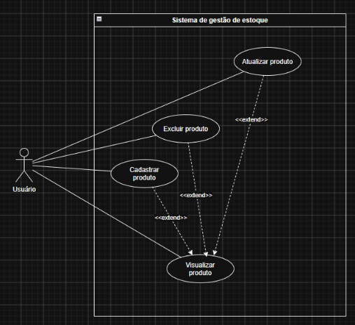

# Projeto Sistema de gestão de produtos

## Objetivo do sistema

O projeto consiste em um CRUD simples para um sistema de gestão de produtos, aplicando todos os conceitos do CRUD: CREATE, READ, UPDATE e READ. Além disso foi aplicado prepared statements para maior segurança e evitar SQL injection no código. A interface é simples e rápida, sem a grande utilização de um arquivo CSS, apenas cores simples e básicas. O sistema contém tudo o que um CRUD precisa, incluindo o script do banco de dados. O projeto foi desenvolvido com o intuito da aplicação de um sistema simples para ser utilizado de recuperação de atividades.

## Tecnologias utilizadas

    | Tecnologia | Utilização |
    |------------|------------|
    | HTML | Estrutura das páginas - frontend |
    | CSS | Estilização |
    | PHP | Lógica do sistema - backend |
    | MySQL | Banco de dados |
    | XAMPP | Servidor local |

## Requisitos para execução

Para a execução local do sistema é necessário rodar o banco de dados, inserir a pasta do arquivo na pasta "Htdocs" dentro da pasta "XAMPP" na máquina, assim acessar o sistema buscando por "localhost/sistema-gestao-produtos".

## Intruções para instalação/configuração

Para rodar o banco de dados, basta copiar o script localizado dentro da pasta "database", assim acessar "localhost/phpmyadmin", ir até a aba "SQL" e executar o código. Para realizar a configuração da conexão é necessário informar o Host, Usuário do MySql, Senha do MySql, Porta localizada o MySql e nome do banco de dados, assim ajustando as variáveis no arquivo "conexao.php", é possível acessar o sistema completo.

## Estrutura do banco de dados

CREATE DATABASE sistema_gestao_produtos;

USE sistema_gestao_produtos;

CREATE TABLE produtos (
        id INT AUTO_INCREMENT PRIMARY KEY,
        nome VARCHAR(100) NOT NULL,
        categoria VARCHAR(100) NOT NULL,
        descricao VARCHAR(200) NOT NULL,
        preco INT NOT NULL,
        quantidade_estoque INT NOT NULL,
        data_validade DATE NOT NULL
    );

## Documentação

### Requisitos funcionais

    | RF1 | O sistema deve permitir o cadastro de produtos |
    | RF2 | O sistema deve permitir visualizar os produto |
    | RF3 | O sistema deve permitir a atualização de produtos |
    | RF4 | O sistema deve permitir a exclusão de produtos |

### Requisitos não funcionais

    | RNF1 | O sistema deve utilizar Prepared Statements |
    | RNF2 | O sistema deve validar os dados recebidos |
    | RNF3 | O sistema deve ter um tratamento básico de erros |
    | RNF4 | O sistema deve ter uma estrutura organizada |

### Caso de uso

